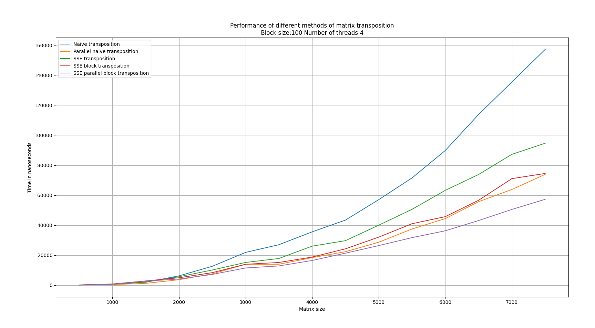

# Fast Matrix Transposition 

This repository contains functions with different approaches to Transposition of Matrix and performance tests of them.

We sequentially implement :  
1. Naive matrix transposition (single-thread)  
2. Parallel naive matrix transposition (multi-threads)  
3. SSE matrix transposition (single-thread)  
4. SSE Block matrix  transposition (single-thread)    
5. and fastest variant <b>SSE Parallel Block matrix transposition</b> (multi-threads)   

## Results of performance tests:

  

All tests were performed on <i> "Intel(R) Core(TM) i7-8650U CPU @ 1.90GHz" with 16 GB of DDR4 RAM </i>  
As can be seen significant difference apears starting with matrix about 2000x2000   

<b> SSE Block matrix transposition </b> approach faster than any other single-thread approaches  
<b> SSE Parallel Block matrix transposition </b> fastest at all     

## How-to-start tests:

### To start performance test build and run following: 

FastMatrixTransposition [matrix_size] [block_size] [number_of_threads] [number_of_tests performance tests for each approach]  

Will outputed average times for each approah    

### Example of output:   
8000,194659.156250,97701.046875,140561.281250,86731.703125,62631.093750  

### Format of output:  
[matrix_size],[naive approach], [parallel naive approach], [SSE matrix transposition], [Block transposition], [Block SSE parallel transposition] 

All times in nano seconds 
